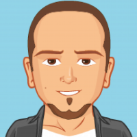
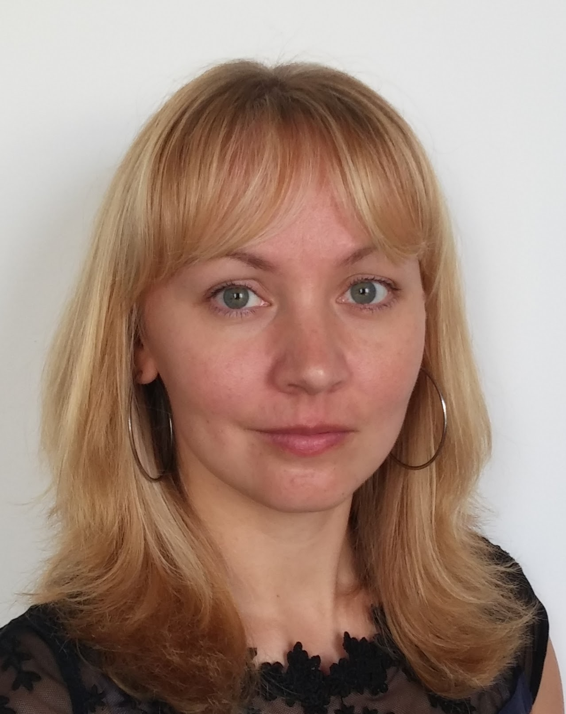
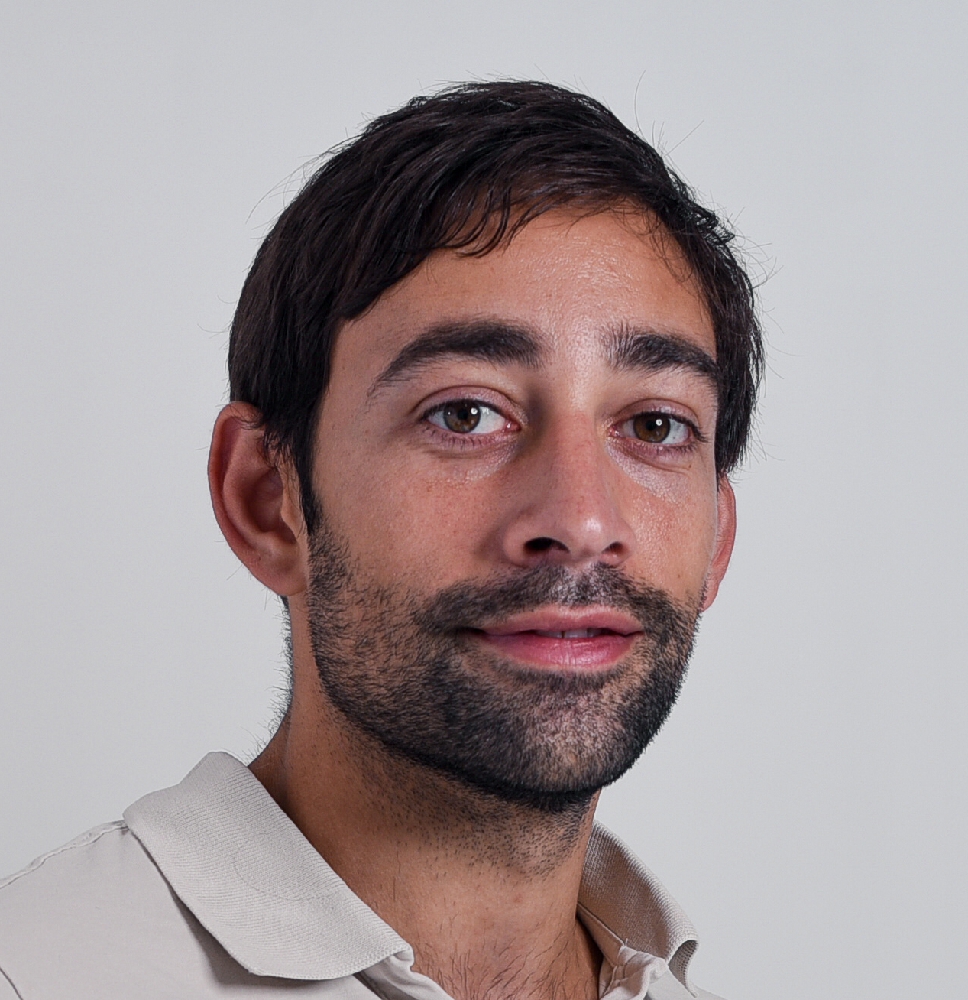

#### Renato Alves     
###### Senior Bioinformatics Community Manager at EMBL, Heidelberg

<table>
<tr>
    <td style="width: 20%;"></td>
    <td style="width: 80%;">Renato Alves is a Senior Bioinformatics Community Manager. In his role, he supports the Bio-IT community in the four pillars of the Bio-IT project: Training and Consulting, Infrastructure, Community and Networking, and Information dissemination.</td>
</tr>
</table>
  
    
 

#### Nina Norgren     
###### Training Manager, SciLifeLab, Sweden  

<table>
<tr>
    <td style="width: 20%;"></td>
    <td style="width: 80%;">Nina is a Training Manager at SciLifeLab. She has a background in biology and bioinformatics, but is now mostly working with Training. She is managing several of the services offered by SciLifeLab training, including the SciLifeLab Training portal. </td>
</tr>
</table>
  
    
 

#### Osvaldo Burastero     
###### Scientific software developer, Buenos Aires, Argentina  

<table>
<tr>
    <td style="width: 20%;"></td>
    <td style="width: 80%;">Osvaldo is a former ARISE Fellow from EMBL. He has a background in biology and data science. 
    During his time at EMBL, he developed an online, open-source, user-friendly platform for the
    analysis of biophysical data: <a href="https://www.spc.embl-hamburg.de/" target="_blank" rel="noopener noreferrer">eSPC platform</a> </td>
</tr>
</table>
  
    
 