# Maintenance and future perspectives

<h3>by <a href="https://www.linkedin.com/in/osvaldo-burastero/" target="_blank">Osvaldo Burastero</a></h3>

October 2026

---

## Which lifeguard is better?

Assuming the exact same conditions:

**A)** Four rescues in one month or **B)** Zero rescues in one month

::: {.columns}

::: {.column width="30%"}

:::
::: {.column width="70%"}

::: {.fragment}
### [(B)]{.blue-text}
:::

::: {.fragment}
**The best lifeguard is the one who never needs to perform a rescue.**
:::

::: {.fragment}
Because risks were prevented before they became incidents.
:::

:::

:::

---

## Research software abandonment

::: {.column width="49%"}

<<
We screened the availability of 2396 web tools published during the past 0 years.
In a 133-day test frame, 31% of tools were always working, 
48.4% occasionally and <b>20.6%</b> never.
>>

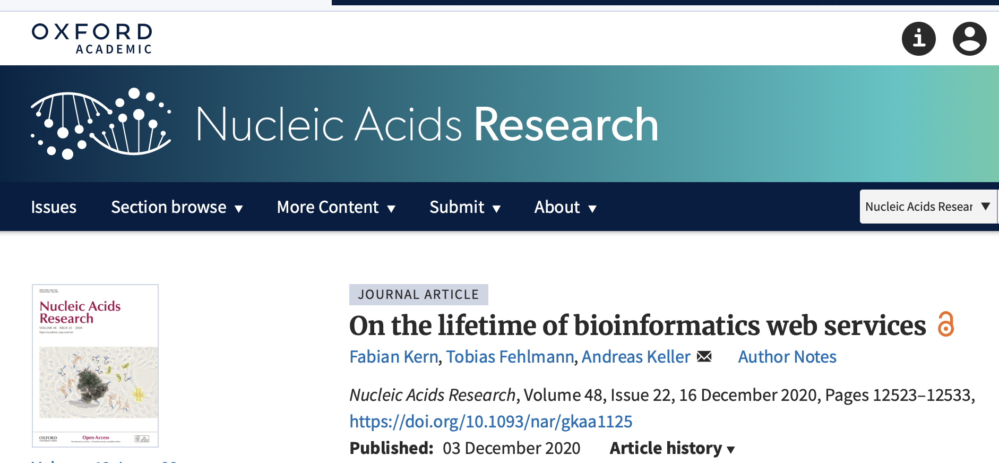
:::

::: {.column width="1%"}
::: 

::: {.column width="49%"}
::: {.fragment}

<<
Our empirical analysis of 24,490 omics software resources published 
from 2000 to 2017 shows that <b>26%</b> of all omics software resources are not 
currently accessible through URLs published in the original paper.
>>

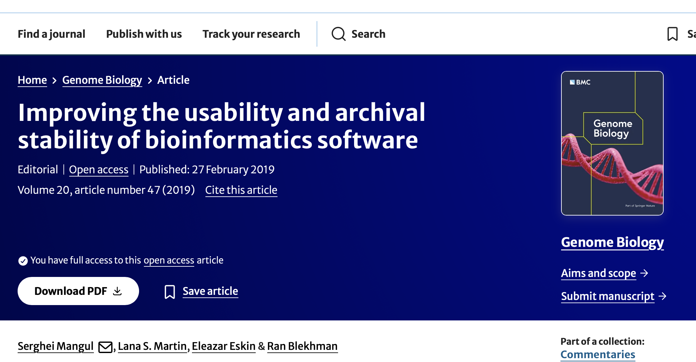
:::
:::

---

## The problem of maintenance

::: {.fragment}
1. Biology depends on software
::: 
::: {.fragment}
2. Many of the tools are developed by trainees, PhD students and postdocs
::: 
::: {.fragment}
3. Funding incentivates new applications, not maintenance
::: 
::: {.fragment}
4. Circa one every four published tools become inaccesible
:::
::: {.fragment}
5. Therefore, maintenance must be planned as part of service delivery
from the very beggining
:::
---

## The hidden reality of maintenance

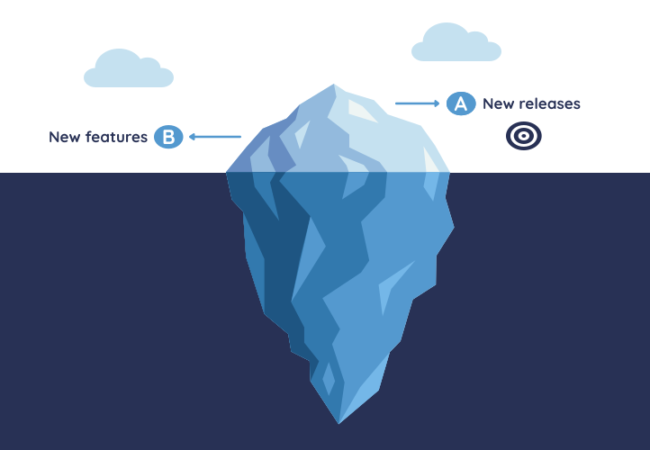

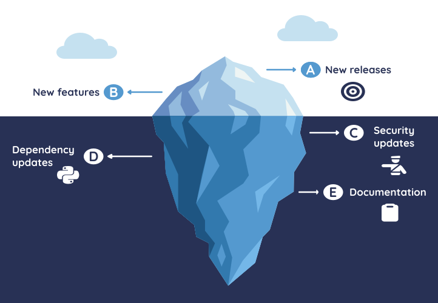

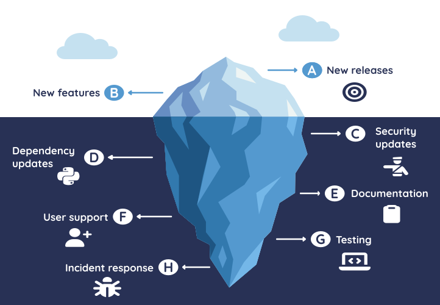

---

## From theory to practice

---

## Documentation

::: columns
::: {.column width="50%"}
Purpose:

- For fellow developers
- For external developers
- For end users
::: 

::: {.column width="50%"}
::: {.fragment}
eSPC:

- <a href="https://github.com/SPC-Facility-EMBL-Hamburg/eSPC_biophysics_platform" target="_blank">Github repo</a> and <a href="https://www.redmine.org" target="_blank">Redmine</a>
- Github repo
- User Guide (HTML) and User manual (.doc)[^user-docs] 
:::
:::
:::
[^user-docs]: Regularly updated based on user-feedback and new input files

---

## Testing

Purpose[^caution]:

- To discover and prevent possible bugs
- To add code without breaking previous functionalities

::: {.fragment}
Types:

::: columns
::: {.column width="50%"}
- Manual (performed by a person)
:::
::: {.column width="50%"}
- Automated (performed by a machine)
:::
::: 
:::
[^caution]: Testing ≠ scientific correctness

---

## Testing

Types of tests:

- ::: {.fragment fragment-index=1}
  Unit tests: for individual methods
  :::

- ::: {.fragment fragment-index=2}
  Integration tests: modules working together
  :::

---

## Testing

Types of tests:

- Unit tests: for individual methods

- Integration tests: modules working together

- End-to-end: Replicate user-behaviour

- etc[^atlassian]...

[^atlassian]:
More info in <a href="https://www.atlassian.com/continuous-delivery/software-testing/types-of-software-testing" target="_blank">www.atlassian.com</a>

---

## Testing

eSPC examples:

::: {.column width="50%"}
Unit test
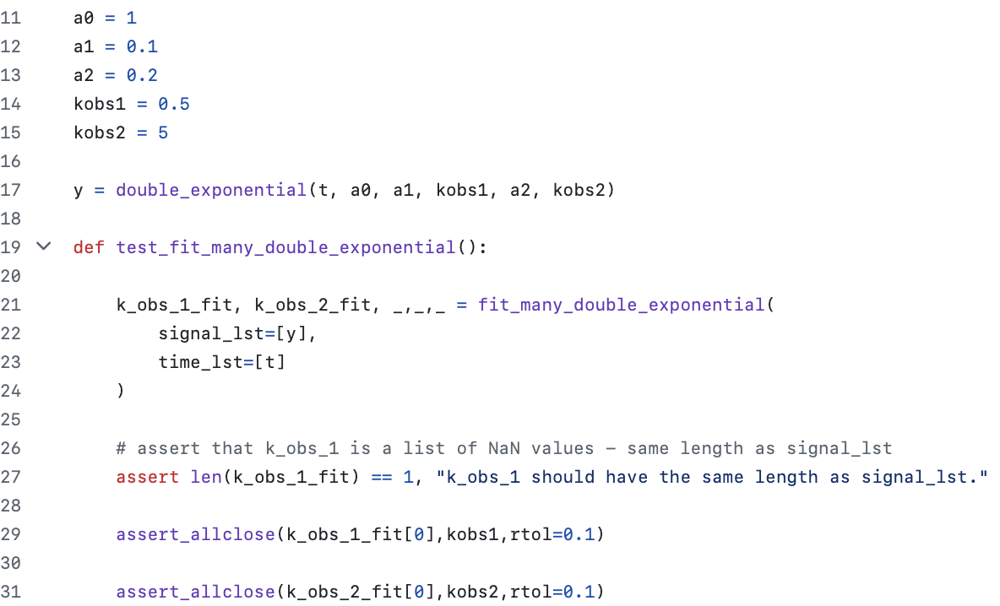
:::

::: {.column width="50%"}
::: {.fragment}
User-workflow
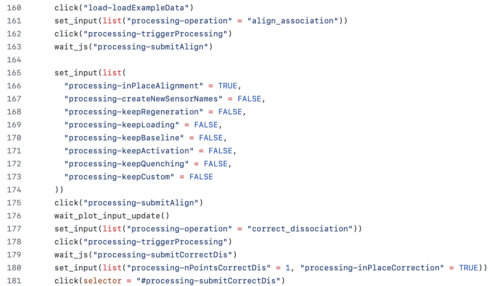
:::
:::

---

## Dependencies

Challenges:

- Changes in dependencies may break the current code.

Solution:

- Use computational environment with fixed versions.
For instance, <a href="https://docs.astral.sh/uv/" target="_blank">uv</a> for python 
and <a href="https://rstudio.github.io/renv/articles/renv.html" target="_blank">renv</a> for R.

- Have tests so newer software versions can be easily validated.

---

## Dependencies 

The licenses of the dependencies condition the license of your service

Case in EMBL: Change of license terms from Anaconda

::: {.column width="65%"}
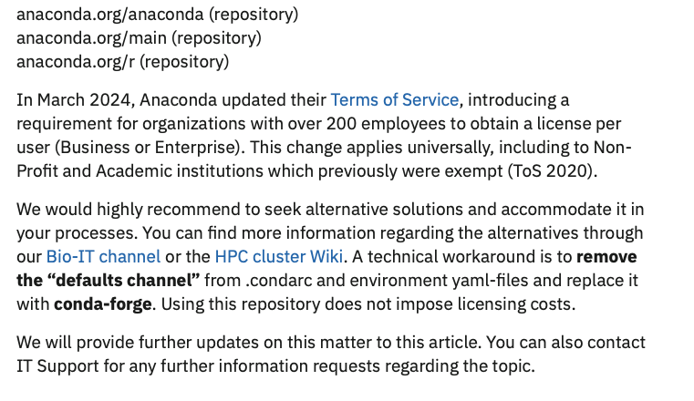
:::

---

## Security updates 

Purpose:
To patch software vulnerabilities and avoid unauthorized access to data or service disruptions

Recommendations:

::: {.column width="70%"}
- Get an overview of the programs that are used and for those which do not update automatically, scout regularly for updates 
- Do regular backups!
:::

---

## Security requirements @EMBL

- Service needs to have a technical owner responsible for updating the service
- Asset data needs to be classified according to its sensitivity
- Service should be isolated and connections encrypted
- In case of a Security incident, the technical owner must contact the Computer Security Incident Response Team[^Note]

[^Note]: More info in the EMBL intranet

---

## Security @eSPC

::: {.column width="85%"}

:::

---

## User support - GDPR compliance

If you process data you have to do so:[^info-gdpr]

- Lawful, fair and transparent to the data subject
- For legimitate purposes specified at the moment of data collection
- Collect only necessary data
- Keep personal data up to date
- Ensure integrity and confidentiality of the data
- Be accountable

[^info-gdpr]: <a href="https://gdpr.eu/what-is-gdpr/" target="_blank">https://gdpr.eu/what-is-gdpr/</a>

---

## User support - GDPR @EMBL

Data subjects have the right[^info-embl]

- that no significant decisions are taken without human intervetion
- request the processed data in a clear and understandable format
- to know the reasons for processing and object it
- request rectification or removal of data
- withdrawn consent at any time

[^info-embl]: <a href="https://www.embl.org/info/data-protection/" target="_blank">https://www.embl.org/info/data-protection/</a>

# Future perspectives

---

## Integrating AI in online data services

For your project you should evaluate that

- AI agents will interact with your service:
     - Provide a well-documented API
     - Use machine-readable data
     - Include rich metadata
     - Enable automation and bulk operations
     - Enforce rate limits

---

## Integrating AI in online data services

For your project you should evaluate if:

- AI will be available inside the service for users to help them:
     - Depositing the data
     - Processing the data
     - Visualizing the data
     - Analysing the data
     - Searching the data
     - Fetching the data

---

## Integrating AI @eSPC

We started building MCP servers that will let users analyse the data by chatting

::: {.column width="100%"}
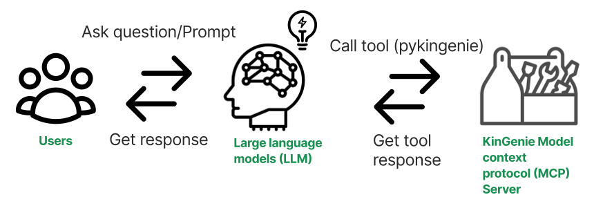
:::

# Thank you!

::: {.columns}

::: {.column width="30%"}

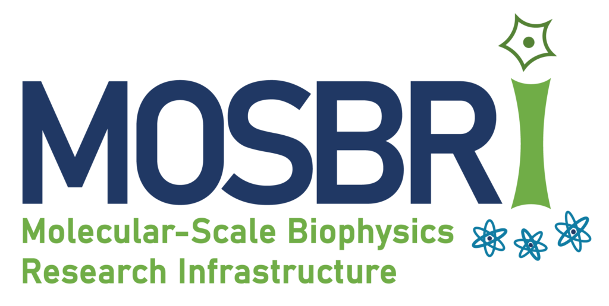

:::
::: {.column width="11%"}
:::
::: {.column width="14%"}

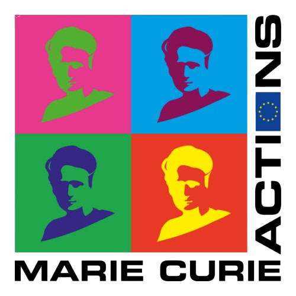

:::
::: {.column width="11%"}
:::
::: {.column width="30%"}

:::

:::

::: {.columns}

::: {.column width="30%"}

:::
::: {.column width="3%"}
:::
::: {.column width="30%"}

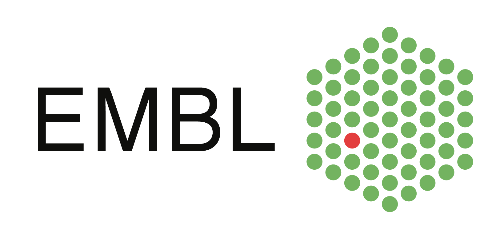

:::
::: {.column width="3%"}
:::
::: {.column width="34%"}

:::

:::

- EMBL Garcia-Alai Team
- EMBL Hamburg IT Team

