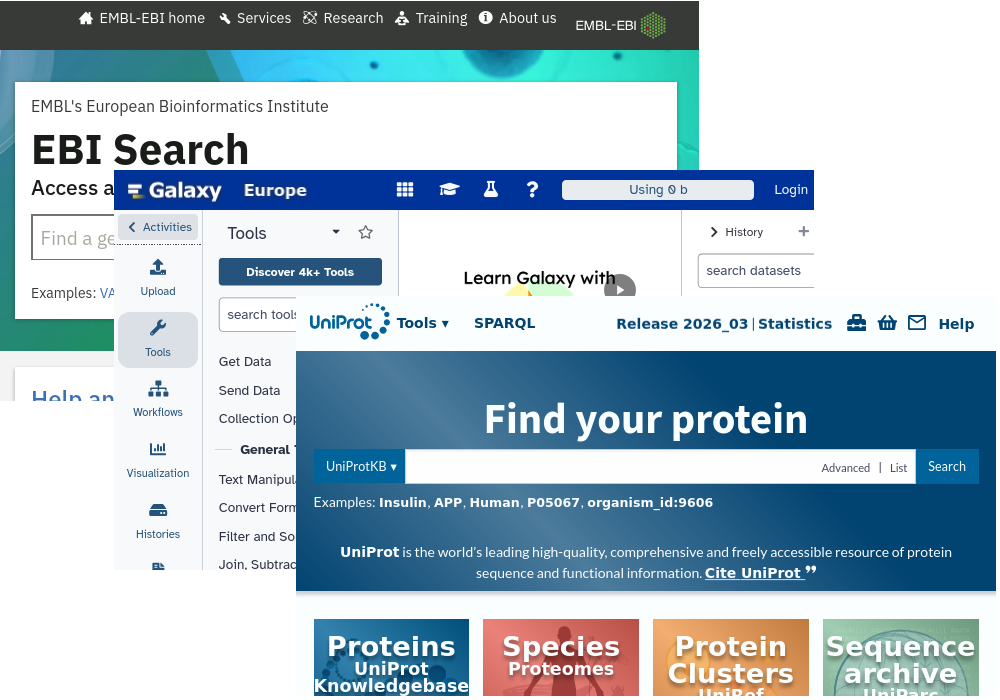
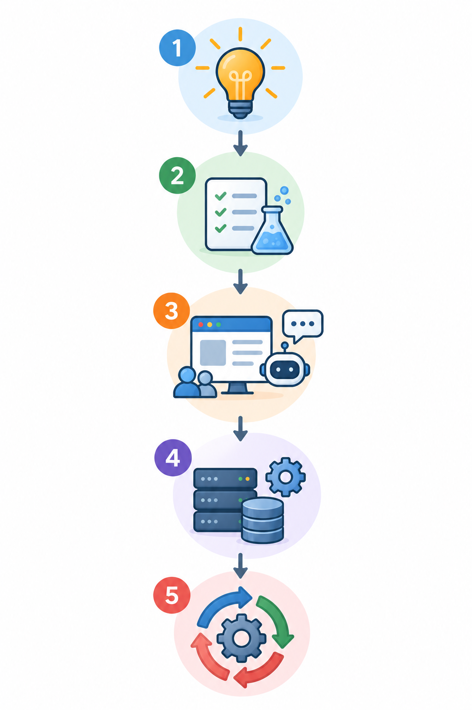
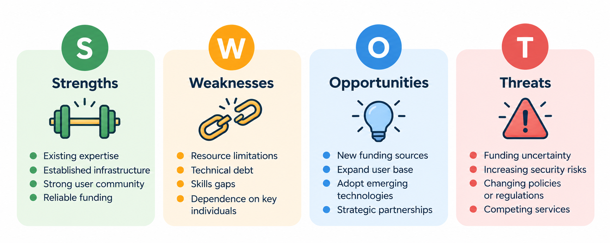
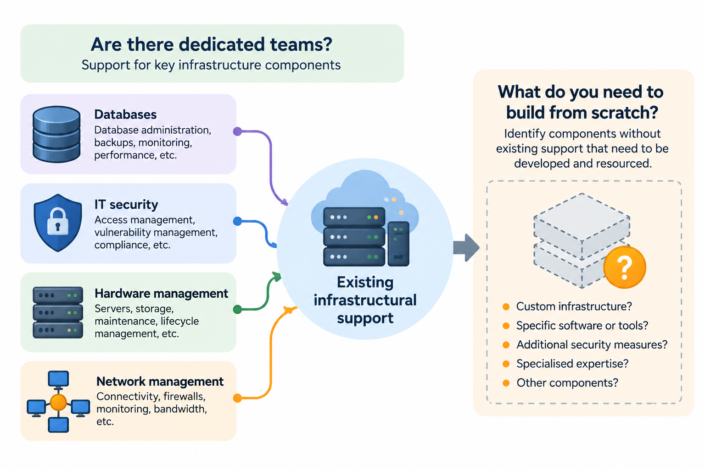
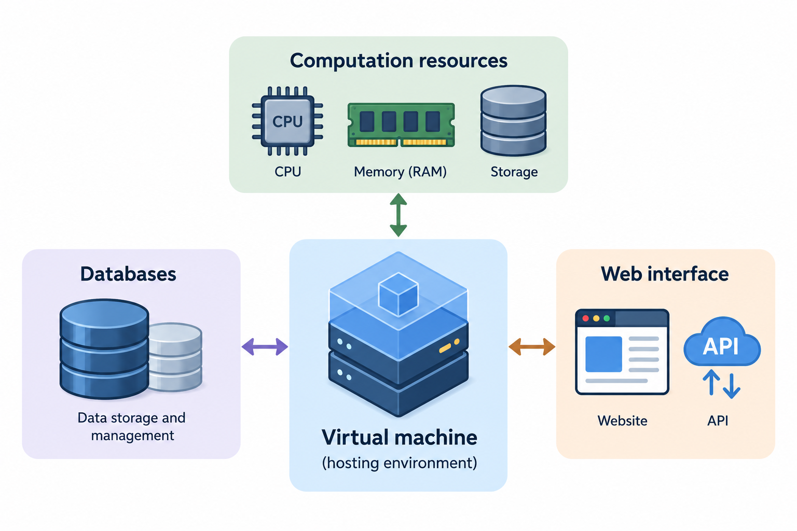
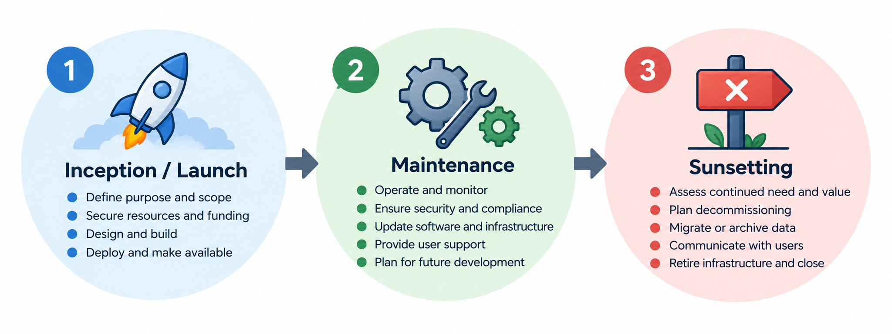

# Provision of **public** data services

## Learning outcomes

- Define what is a data, a service and provision
- Identify service value and market relevance
- Contrast the resources needed to start and scale a service
- Define a plan for first release or prototype

## Data, Service and Provision

Definitions as per *Cambridge Dictionary*:

::: {.incremental}
- **Data** - *information, especially facts or numbers, collected to be examined and considered and used to help decision-making*
- **Service** - *a government system or private organization that is responsible for a particular type of activity, or for providing a particular thing that people need*
- **Provision** - *the act of providing something*
:::

## Data, Service and Provision

General definitions we'll use:

::: {.incremental}
- **Data** - *any kind of information that is perceived to contain or provide value*
- **Service** - *a website, analysis portal or knowledge exchange offer*
- **Provision** - *how to make said service available*
:::

## Service examples

::::: {layout-ncol=2}

:::: {#first-column}

- [Uniprot](https://www.uniprot.org/)
- [EBI Search](https://www.ebi.ac.uk/ebisearch)
- Analysis platforms
  - [eSPC Hamburg](https://spc.embl-hamburg.de)
  - [Shiny Apps](https://shiny-portal.embl.de/shinyapps/app/21_xrcs)
  - [Galaxy Project](https://usegalaxy.eu/)

::: {.fragment}

### "Non-examples"

- Creating a core-facility service (business-model)
- Services internal to an organisation (intranet)

:::

::::

:::: {#second-column}

::::

:::::

---

## Identifying a service use-case

::::: {layout=[66,33]}

:::: {#first-column}

::: {.incremental}
- Idea / Concept
- Need / Design
- Interface to users
  - AI systems?
- Prototype - meeting the need
- Resourcing / Implementation
- Maintenance / Life cycle
:::

::::

:::: {#second-column}

::::

:::::

## Market analysis (alternatives/competitors)

::: {.incremental}
- Access to compute, data, other primary resource
- Similarities and differences to alternatives
- SWOT analysis
:::

::: {.fragment}
{fig-align="center" width="80%"}
:::

## Prototyping / Tech demo

::: {.incremental}
- What is the need being met?
  - Key value elements
- Mock-up vs technical demo
- User stories
- Interation process (Agile, SCRUM, ...)
:::

---

## Infrastructural support

::: {.fragment}
{fig-align="center" width="80%"}
:::

## Infrastructural support

Practices in **your organisation**

::: {.incremental}
- Responsibilities and governance
  - Who's responsible for what? - transparency
    - Data Protection (e.g. GDPR / IP68)
      - Data privacy notice
      - Terms of Service (ToS)
    - User support (more on this later)
:::

---

## Provisiong and resourcing

::: {.incremental}
- In-house or elsewhere
- Cloud, HPC, Kubernetes, ...
:::

::: {.fragment}
{fig-align="center" width="65%"}
:::

## Provisiong and resourcing

::: {.incremental}
- Business model
  - Citations
  - Grants and projects
  - Subscriptions, licensed or other user-paying models
:::

::: {.fragment}
More on **Key Performance Indicators** (KPI) later
:::

## Life-cycle management

::: {.fragment}
{fig-align="center" width="80%"}
:::

## Versioning and releases

::: {.incremental}
- Unversioned
  - Rolling forward
    - Speed (AI!)
- Versions
  - Stability proxies (Alpha, Beta, Gamma, ...)
  - Semantic versioning ([SemVer](https://semver.org/))
  - Calendar versioning ([CalVer](https://calver.org/))
  - Idiosyncratic systems (e.g. [Asymptotic π Versioning](https://en.wikipedia.org/wiki/TeX))
- Archiving
  - Old versions available?
  - For how long?
:::

# Questions at the end
