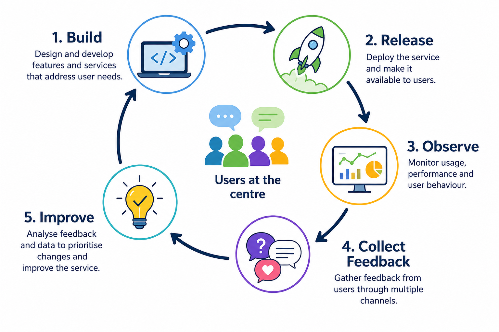
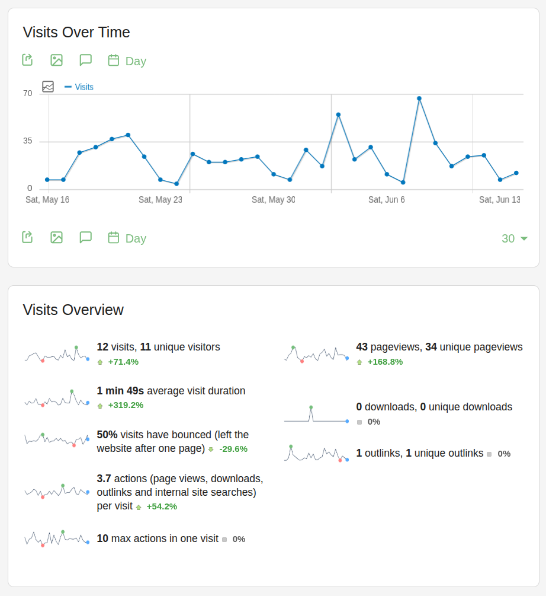

# Feedback and User interactions

## Learning outcomes

- Describe strategies for engaging with users and communities
- Identify approaches for evaluating and improving a public data service

## Why User Feedback Matters

 

> A service is only successful if users can use it

 

Public data services often focus heavily on:

- Data quality
- Infrastructure
- Technology

## Why User Feedback Matters

 

> A service is only successful if users can use it

 

But users experience:

- Interfaces
- Documentation
- Support channels
- Response times

::: {.fragment}

**User feedback is one of the most important inputs for improving a service.**

:::

--- 

  

1. ### How do users tell you when something is wrong?

 

2. ### How do you know whether your service is meeting their needs?

## A continuous improvement cycle

 

{fig-align="center"}

## A continuous improvement cycle

 

Feedback can come from:

- Direct user support requests
- Bug reports
- User surveys
- Community discussions
- Usage analytics
- Training events and workshops

::: {.fragment}

>Move from guessing what users need to learning from actual users.

:::

## Implementing new Features

 

Questions to ask before releasing a new feature

 

1. Does anyone actually need this?
2. Is the problem clearly defined?
3. Can we test the idea before fully implementing it?

## Common approaches

 

#### Prototype

- Early mock-up
- Demonstrates concepts
- Low development effort

## Common approaches

 

#### Prototype
#### Proof-of-Concept (PoC)

- Tests technical feasibility
- Answers "Can this work?"

## Common approaches

 

#### Prototype
#### Proof-of-Concept (PoC)
#### Pilot users

- Small group of real users
- Early feedback before wider release

## User Testing and A/B Testing

 

#### User testing

- Observe users performing tasks
- Identify pain points
- Evaluate usability

::: {.fragment}

Examples:

1. Finding a dataset
2. Uploading data
3. Running an analysis workflow

:::

## User Testing and A/B Testing

 

#### A/B Testing

 

**Version A:**

Current design

**Version B:**

New design

 

Measure:

- Completion rate
- Time to task completion
- User satisfaction

## Handling Bug Reports

 

Make it easy to report bugs

 

>Bad:
>"Send an email to support."

 

>Better:
>Structured bug reporting form

## Handling Bug Reports

 

>Better:
>Structured bug reporting form

 

Useful information:

- What happened?
- What was expected?
- Steps to reproduce
- Browser/software version
- Screenshots
- Contact details

## Handling Bug Reports

 

>Better:
>Structured bug reporting form

 

Benefits:

- Easier to recreate the issue
- Faster troubleshooting
- Better prioritisation
- Easier communication

## User interactions channels

 

Different users prefer different channels

 

| Channel  |  Strengths |  Weaknesses  |
|----------|------------|--------------|
| Email    | Familiar and universal | Hard to search |
| Online forms | Structured information | Less conversational |
| Github issues | Track issues | Technical barrier |
| Community forums | Shared knowledge | Require moderation |

## Which one to choose?

 

Depends on the user interaction:

**Technical users -> GitHub Issues**  
**General users -> support email or form**

 

Direct user support is normally through email or online form, but it can be useful to have a public forum for community discussions and shared knowledge.

 

::: {.fragment}

> Accept feedback through multiple channels, but manage issues through a single tracking system

:::

# Can Your Service Scale?

## Service Scale and Scalability

 

What happens if your service becomes successful?

- Can the infrastructure handle more users?
- Can it handle larger datasets?
- Can it handle more simultaneous requests?
- Can support staff keep up with demand?

## Types of scalability

 

#### Technical

- CPU, memory, storage
- Network bandwidth
- Database performance

## Types of scalability

 

#### Technical
#### Operational

- Documentation
- User support
- Onboarding processes
- Scalability testing

## Types of scalability

 

#### Technical
#### Operational

 

Examples:

- Load testing
- Stress testing
- Performance benchmarking

## Monitoring Your Service

 

What should be monitored?

 

#### Technical metrics

- Uptime
- Response times
- Error rates
- Storage usage

## Monitoring Your Service

 

What should be monitored?

 

#### Technical metrics
#### Usage metrics

- Number of users
- Number of sessions
- Most used features
- Geographic distribution

## Example: Matomo

 

{fig-align="center" width="100%"}

## Example: Matomo

 

- Visits
- User journeys
- Referral sources
- Downloads
- Returning users

 

::: {.fragment}

#### Why monitor?

- Understand user behaviour
- Detect problems early
- Prioritise future development

:::

## Measuring Success

 

Success can mean different things

- Many users?
- Happy users?
- Scientific impact?
- Community adoption?
- Sustainability?

::: {.fragment}

Define success before measuring

>What problem was the service created to solve?

The answer should guide your metrics

:::

## Key performance indicators (KPIs)

 

KPIs help track progress towards goals

 

| Goal | Possible KPI  |
|------|-------------- |
| Increase adoption | Number of active users |
| Improve usability | User satisfaction score |
| Increase visibility | Citations and referrals |
| Improve reliability | Uptime percentage |
| Build community | Workshop participants |

 

::: {.fragment}

>Not everything important is easy to measure.  
>Not everything measurable is important.

:::

## Exercise questions

2-3 exercise questions per session

Imagine your service has existed for three years.

How would you convince a funder that it has been successful?

Consider:

What evidence would you collect?
Which KPIs would you track?
What stories would you tell?

Imagine a user encounters a problem with your service, either a bug in the system or they just want user guidance.

How should they contact you?

Discuss:

Which reporting channels would you offer?
Which channel would you recommend as the primary route?
How would you ensure reports are not lost?

You want to introduce a major new feature.

How would you test it before releasing it broadly?

Would you use:

Prototypes?
Pilot users?
Proof-of-concepts?
A/B testing?

What are the advantages and disadvantages of your chosen approach?

Question 1

Suppose your service becomes ten times more popular next year.

What challenges might arise?

Think about:

Infrastructure
Data storage
User support
Documentation
Funding

Which challenge would concern you most?

You have been asked to demonstrate the impact of your service to a funder.

What evidence would you collect?

Choose:

2–3 quantitative indicators (KPIs)
1–2 qualitative indicators (e.g. user stories)

Explain why you selected them.